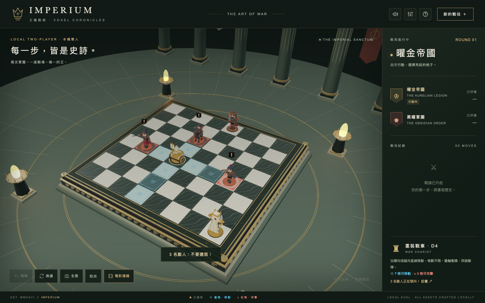
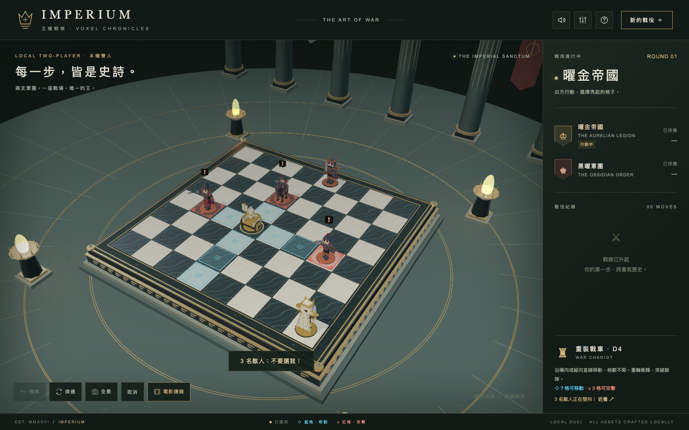
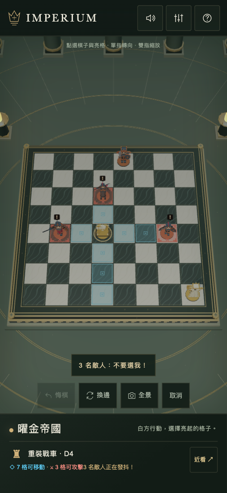
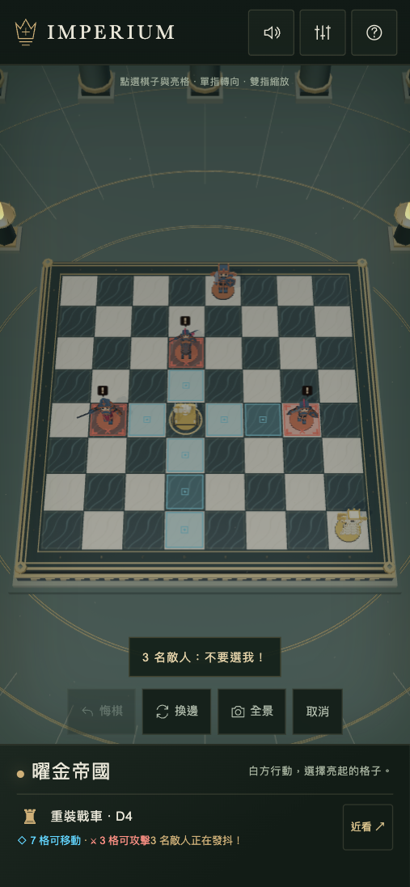

# 基本／加強光影驗證

2026-09-25。正式建置，macOS Chrome / Apple M4 Pro / ANGLE Metal。

## 變更

- 基本模式使用原來的 PBR 材質與燈光；加強模式使用原創材質微紋理、粗糙度變化、背光面層次、冷暖色調和柔和接地陰影。
- 手機預設基本、桌面預設加強；localStorage 記住選擇，切換不重開遊戲。
- 一張本機生成的 128×128 紋理，接地陰影共用單一 instanced draw。沒有額外全畫面後處理、反射鏡頭或遠端資源。
- 參考 [Afterlight](https://github.com/nickfromlater/afterlight) 的材質與冷暖光影思路；沒有複製其素材或原始 shader。

## 同一靜止場景交替測量

每模式測量 80 次，先暖機 15 次；基本／加強交替兩輪。數據為 renderer.render + gl.finish 的同步完成時間，包含 CPU/GPU 等待，並非獨立 GPU 計時，也不是實體手機效能。

| 畫面 | 基本中位數 ms（兩輪） | 加強中位數 ms（兩輪） | 額外 draw |
| --- | --- | --- | --- |
| 1440×900、DPR 1 | 0.60, 0.60 | 0.60, 0.70 | 1 |
| 390×844、DPR 1.3，手機模擬 | 0.60, 0.50 | 0.70, 0.60 | 1 |

所有對照場景沒有瀏覽器或 shader 錯誤。照片已人工查看，棋格提示／戰場目標仍清楚，接地陰影與金屬暗面層次可見。這次改動偏向材質與照明，保留細緻體素美術；不宣稱重現 Afterlight 的寫實都市。

## 畫面對照

### desktop

基本：

加強：

### phone

基本：

加強：

## 限制

Chrome 手機模擬已驗證触控與排版，尚未在實體 iOS／Android 裝置測試 Safari、GPU 和長時間熱降頻。加強模式切換第一次可能有短暫 shader 編譯；卡頓時可立即切回基本模式。
